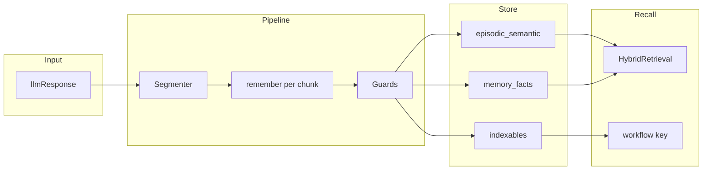

# North star — PSM production memory

## Problem

PSM checkpoints pass **dual gate** on curriculum-shaped probes but fail the **product task**:

- `remember({ llmResponse })` should extract durable facts from **assistant text** (plans, summaries, agent output).
- Today the model emits **curriculum autocomplete** (e.g. "Today run constoursated fact parser") or **fail-safe ignore**.
- Retrieval can hit dialogue tags while **content has no facts** → 0% answer quality.

LoCoMo exposed this; **Cursor handoffs and agent plans are the primary product shape.**

## Correct task definition

```text
remember_target (= llmResponse: assistant text / summary / narrative)
  → store | ignore
  → memory.content + facts[] + indexables[] grounded in remember_target
```

**Not:** "user utterance → memory." The `User:` prefix in training is a legacy convention from `to_model_input()` rewriting assistant-only payloads.

## Target pipeline



## Success metrics (ship bar)

| Metric | Target |
|--------|--------|
| `content_grounding_rate` | ≥ 85% on held-out prod suites |
| `curriculum_bleed_rate` | ≤ 2% |
| `fail_safe_ignore_rate` | ≤ 10% at prod token budget |
| Indexable recall | `review-pr` + 5 synthetic keys hit correct workflow/memory |
| Regression gate | parse ≥ 95%, action ≥ 85% on **×2** expanded subset only |

## Non-goals (this initiative)

1. Promoting on dual gate alone.
2. More Gate 6 runs with ×25 expanded anchor as primary training mass.
3. Assuming **100M/200M model size** fixes extraction (size ≠ context; chunking handles length).
4. Training on LoCoMo QA labels.
5. LoCoMo as the only eval — it is one suite among many.

## What “model” means here

Training should teach the **pattern**: any `remember_target` → grounded extraction.

Not: memorize "Today I fixed the fact parser" templates and autocomplete on OOD chat.

## Checkpoint policy

- **Baseline donors:** HF `058000` preferred over `062000` for new curriculum.
- **Promotion:** grounding + indexables + regression gate — see [phase-6-promotion-ship.md](phase-6-promotion-ship.md).
