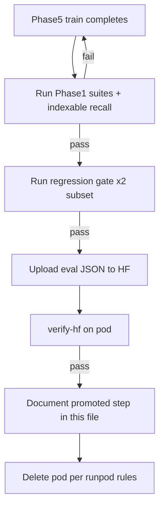

# Phase 6 — Promotion and ship

**Status:** Not started  
**Goal:** Replace “dual gate = ship” with explicit production bar.  
**Depends on:** [Phase 5](phase-5-curriculum-training.md)

---

## Promotion bar (all required)

| Check | Threshold |
|-------|-----------|
| Phase 1 suites — `content_grounding_rate` | ≥ 85% |
| Phase 1 suites — `curriculum_bleed_rate` | ≤ 2% |
| Phase 1 suites — `fail_safe_ignore_rate` | ≤ 10% |
| Indexable recall | `review-pr` + 5 synthetic keys correct |
| Regression gate (×2 expanded only) | parse ≥ 95%, action ≥ 85% |
| HF manifest | `.pt` + `.tokenizer.json` + `.meta.json` + eval JSON |

**LoCoMo** may be run as diagnostic; not sufficient alone.

---

## Promotion workflow

---

## Tasks

- [ ] Add promotion checklist to [training-playbook.md](../../psm-model/training-playbook.md).
- [ ] Require `prod-grounding-*.json` in HF repo alongside checkpoint.
- [ ] Block pod delete if eval artifact missing (extend runpod_ctl if needed).
- [ ] Document winning checkpoint step + artifact paths below.

---

## Files to touch

| Path | Role |
|------|------|
| [docs/psm-model/training-playbook.md](../../psm-model/training-playbook.md) | Promotion section |
| [psm-model/scripts/runpod_ctl.py](../../../psm-model/scripts/runpod_ctl.py) | HF verify gate |
| [README.md](README.md) | Phase 6 complete |

---

## Exit criteria

- [ ] One checkpoint promoted and documented with eval artifact paths.
- [ ] Playbook references this bar as authoritative.

---

## Promoted checkpoint

_(None yet.)_

| Field | Value |
|-------|-------|
| HF repo | — |
| Step | — |
| Grounding (aggregate) | — |
| Bleed | — |
| Eval artifact | — |
| Date | — |
